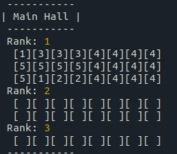
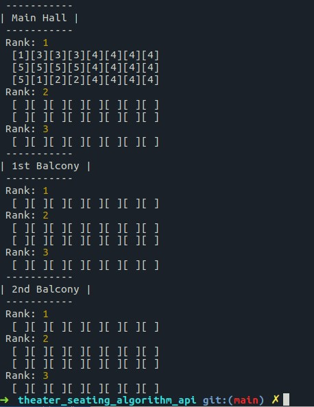

# Theater Seating Algorithm

---

1. [Setup](#setup)
2. [Overview](#overview)
3. [Algorithm](#algorithm)
4. [Tests](#tests)
5. [Technologies used](#technologies-used)

---

## Setup

To begin please clone the repository to your local environment:

    git clone https://github.com/mr-robak/theater_seating_algorithm_api

Next, navigate to the app folder:

    cd  theater_seating_algorithm_api

and install the dependencies by running in the terminal:

    npm install

To start the server, run:

    npm start
    or
    node index.js

The server should start, showing up in the console the port it is listening on.

Now head on to the client repo [theater_seating_client](https://github.com/mr-robak/theater_seating_client) and follow the instructions to set it up.

---

## Overview

This node.js application runs an express.js server exposing several api routes for an accompanying [frontend client](https://github.com/mr-robak/theater_seating_client) app. It uses an algorithm to assign seats accordingly to set preferences (seat rank, number of sits), updates stored data and sends it back to the client.

---

## Algorithm

Algorithm is designed to take a given array of "users" per rank of seats in a specific order (e.g. [1, 3, 4, 4, 5, 1, 2, 4] , where index is number of seats to reserve ), and places the users in their seats, e.g.

    1 2 2 2 3 3 3 3
    5 5 5 5 4 4 4 4
    5 6 7 7 8 8 8 8

So the group of size 1 at index 1 gets the front most left seat. Then the group at index 2 of 3 people next to it, until the row fills and wraps to the next row and fills in the other direction.

I have written a .seatingNoPreferences() method that takes layoutObject,numberOfSeats and rankNr parameters, parses the object by section, by rows and by seats looking for the empty seats and returns a new layout with assigned seats.

_Syntax: .seatingNoPreferences(layoutObject,numberOfSeats,rankNr)_

Data model - for the purpose of this assignment data is a simple object which stores theater layout information in key/values pairs representing sections, rows and seats. Data is stored in the JSON file locally.

---

## Tests

Tests are defined in the test file `test.js`

To run tests, execute:

    node tests.js

To help visualize the test results I have written a simple .print() method that takes an layoutObject and showSeatNr parameter and logs current layout to the console (see below for example output).

_Syntax: .print(layout_data, showSeatNr)_

showSeatNr: true => shows seat numbers, false (default) => shows how seats are allocated

---

## Technologies used:

### Client:

- [React.js](https://github.com/facebook/react)

- [react-router-dom](https://github.com/ReactTraining/react-router/tree/master/packages/react-router-dom)

- [Emotion CSS](https://github.com/emotion-js/emotion)

- [Material UI](https://github.com/mui-org/material-ui)

- [Axios](https://github.com/axios/axios)

---

### Server:

- [node.js](https://github.com/nodejs)

- [express server](https://github.com/expressjs/express)

- [cors](https://github.com/expressjs/cors)

- [body-parser](https://github.com/expressjs/body-parser)

#### See the frontend client repository here: [theater_seating_algorithm](https://github.com/mr-robak/theater_seating_client)
